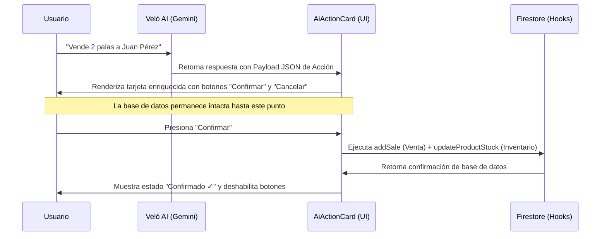

# Investigación Técnica: Confirmaciones Interactivas (Fase 65)

Para garantizar la integridad transaccional de **Veló ERP** y cumplir con las directrices de seguridad, la inteligencia artificial (Gemini) jamás debe realizar escrituras directas sobre Firestore sin una validación humana explícita. Desarrollaremos la tarjeta visual `AiActionCard` para actuar como el "puente de confirmación táctil" de las intenciones de la IA.

---

## 1. Patrón del Puente de Confirmación (Human-in-the-Loop)

El flujo transaccional se comportará bajo el siguiente esquema:

### Seguridad y Sanitización
- El motor de IA solo genera la intención transaccional en un payload estructurado JSON.
- `AiActionCard` recibe este payload en un estado local y sanitiza los campos: valida que las cantidades sean mayores a cero, que el cliente sea una cadena válida y que los precios correspondan a los registrados.
- La escritura solo ocurre mediante la interacción física del cursor/dedo del usuario sobre el botón "Confirmar".

---

## 2. Integración de Hooks del ERP

Para realizar las transacciones reales en base de datos al confirmar, `AiActionCard` consumirá los hooks existentes del ERP de forma aislada por inquilino (`organizationId` extraído del `AuthContext` del usuario):

### Acción: `CREATE_SALE` (Ventas e Inventario)
1. Llama a `addSale` del hook `useSales` para insertar el documento de venta con la numeración secuencial automatizada (Boleta/Factura) en `/organizations/{orgId}/invoices`.
2. Para cada producto vendido, consulta su existencia en el hook `useInventory` y llama a `updateProductStock(productId, newStock)` para descontar las unidades en tiempo real.

### Acción: `DEDUCT_INVENTORY` (Bodega / Materia Prima)
1. Llama a la lógica correspondiente para registrar la salida de stock física en bodega debido a rotura/merma.

---

## 3. Estados de la Tarjeta Visual

Para evitar re-ejecuciones de transacciones o inconsistencias financieras al hacer scroll o reabrir el chat, la tarjeta interactiva mantendrá un estado de vida persistente:
- `pending`: Muestra los datos de la cotización y los botones interactivos "Confirmar" y "Cancelar".
- `executing`: Muestra un spinner de carga y deshabilita las interacciones mientras impacta Firestore.
- `confirmed`: Muestra el mensaje de éxito "Transacción Registrada ✓", oculta los botones y congela los datos.
- `cancelled`: Muestra "Acción Cancelada" y deshabilita los botones.
