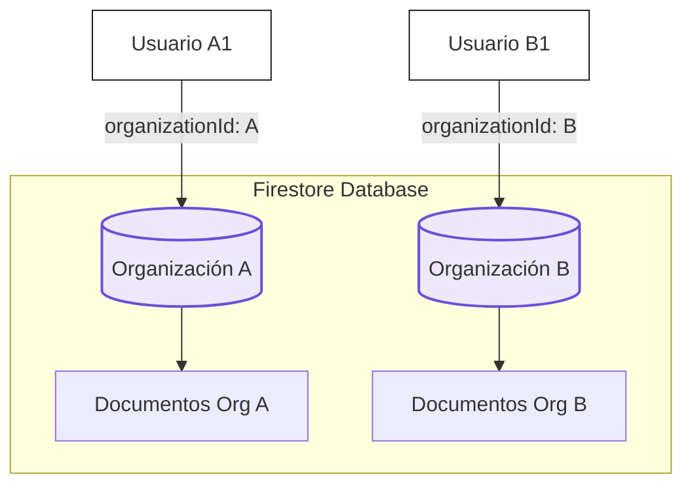

---
pdf_options:
  format: A4
  margin:
    top: 25mm
    bottom: 25mm
    left: 20mm
    right: 20mm
  displayHeaderFooter: true
  headerTemplate: |
    <div style="font-family: 'Inter', sans-serif; font-size: 8px; color: #a3aac4; width: 100%; padding: 0 20mm; box-sizing: border-box; display: flex; justify-content: space-between;">
      <span>PKT ERP - Manual Técnico</span>
      <span>v1.0 (Mayo 2026)</span>
    </div>
  footerTemplate: |
    <div style="font-family: 'Inter', sans-serif; font-size: 8px; color: #a3aac4; width: 100%; padding: 0 20mm; box-sizing: border-box; display: flex; justify-content: space-between; border-top: 1px solid rgba(64, 72, 93, 0.1); padding-top: 5px;">
      <span>Confidencial - Solo Uso Interno</span>
      <span>Página <span class="pageNumber"></span> de <span class="totalPages"></span></span>
    </div>
launch_options:
  executablePath: "C:\\Program Files (x86)\\Microsoft\\Edge\\Application\\msedge.exe"
  args: ["--no-sandbox", "--disable-setuid-sandbox"]
---

<style>
  @import url('https://fonts.googleapis.com/css2?family=Outfit:wght@400;600;700;900&family=Inter:wght@400;500;600;700&family=JetBrains+Mono:wght@400;700&display=swap');

  body {
    font-family: 'Inter', sans-serif;
    color: #1A1A1A;
    line-height: 1.6;
    font-size: 10.5pt;
    background-color: #FFFFFF;
  }

  /* Portada */
  .cover-page {
    page-break-after: always;
    height: 90vh;
    display: flex;
    flex-direction: column;
    justify-content: center;
    align-items: flex-start;
    padding-top: 30mm;
    box-sizing: border-box;
  }
  .cover-title-container {
    border-left: 6px solid #6B4FD8;
    padding-left: 24px;
    margin-bottom: 40px;
  }
  .cover-title {
    font-family: 'Outfit', sans-serif;
    font-size: 36pt;
    font-weight: 900;
    color: #1A1A1A;
    line-height: 1.1;
    margin: 0;
    letter-spacing: -1px;
  }
  .cover-subtitle {
    font-family: 'Outfit', sans-serif;
    font-size: 18pt;
    font-weight: 600;
    color: #6B4FD8;
    margin-top: 10px;
    margin-bottom: 0;
  }
  .cover-meta {
    margin-top: auto;
    padding-bottom: 10mm;
    font-size: 9pt;
    color: #555555;
    display: grid;
    grid-template-columns: 1fr 1fr;
    gap: 15px 40px;
    border-top: 1px solid #e0e0de;
    width: 100%;
    padding-top: 20px;
  }
  .cover-meta-item {
    display: flex;
    flex-direction: column;
  }
  .cover-meta-label {
    font-size: 8pt;
    font-weight: 700;
    text-transform: uppercase;
    color: #a3aac4;
    letter-spacing: 1px;
    margin-bottom: 3px;
  }
  .cover-meta-value {
    font-weight: 600;
    color: #1A1A1A;
  }

  /* Tipografías */
  h1, h2, h3, h4 {
    font-family: 'Outfit', sans-serif;
    color: #1A1A1A;
    font-weight: 700;
    page-break-after: avoid;
  }
  h1 {
    font-size: 22pt;
    margin-top: 30pt;
    margin-bottom: 15pt;
    border-bottom: 2px solid #e0e0de;
    padding-bottom: 5pt;
    page-break-before: always;
  }
  /* Excepción para evitar salto de página en el primer H1 */
  .first-h1 {
    page-break-before: avoid !important;
  }
  h2 {
    font-size: 16pt;
    margin-top: 22pt;
    margin-bottom: 12pt;
    color: #6B4FD8;
    border-bottom: 1px solid rgba(107, 79, 216, 0.15);
    padding-bottom: 4pt;
  }
  h3 {
    font-size: 12pt;
    margin-top: 16pt;
    margin-bottom: 8pt;
  }

  /* Estructura general */
  p {
    margin-top: 0;
    margin-bottom: 12pt;
    text-align: justify;
  }
  ul, ol {
    margin-top: 0;
    margin-bottom: 12pt;
    padding-left: 20px;
  }
  li {
    margin-bottom: 6pt;
  }
  strong {
    font-weight: 700;
    color: #000000;
  }

  /* Bloques de código e inline */
  code {
    font-family: 'JetBrains Mono', monospace;
    font-size: 8.5pt;
    background-color: #F7F7F5;
    padding: 2px 5px;
    border-radius: 4px;
    border: 1px solid #e0e0de;
    color: #6B4FD8;
  }
  pre {
    background-color: #1A1A1A !important;
    padding: 12px;
    border-radius: 8px;
    border: 1px solid #40485d;
    overflow-x: auto;
    margin-top: 12pt;
    margin-bottom: 12pt;
    page-break-inside: avoid;
  }
  pre code {
    background-color: transparent !important;
    padding: 0;
    border-radius: 0;
    border: none;
    color: #f7f7f5 !important;
  }

  /* Bloques de Alerta */
  blockquote {
    margin: 15pt 0;
    padding: 10pt 15pt;
    background-color: #ede9fb;
    border-left: 4px solid #6B4FD8;
    border-radius: 0 8px 8px 0;
    page-break-inside: avoid;
  }
  blockquote p {
    margin: 0;
    color: #1A1A1A;
    font-size: 9.5pt;
    font-weight: 500;
  }

  /* Tablas */
  table {
    width: 100%;
    border-collapse: collapse;
    margin-top: 15pt;
    margin-bottom: 15pt;
    font-size: 9pt;
    page-break-inside: avoid;
  }
  th {
    background-color: #6B4FD8;
    color: #FFFFFF;
    font-family: 'Outfit', sans-serif;
    font-weight: 700;
    text-transform: uppercase;
    font-size: 8pt;
    letter-spacing: 0.5px;
    padding: 8pt 10pt;
    border: 1px solid #6B4FD8;
  }
  td {
    padding: 7pt 10pt;
    border: 1px solid #e0e0de;
  }
  tr:nth-child(even) {
    background-color: #F7F7F5;
  }

  /* Contenedores visuales */
  .modules-grid {
    display: grid;
    grid-template-columns: 1fr 1fr;
    gap: 15px;
    margin-top: 15pt;
    margin-bottom: 15pt;
  }
  .module-card {
    background-color: #FFFFFF;
    border: 1px solid #e0e0de;
    border-radius: 8px;
    padding: 12pt;
    page-break-inside: avoid;
  }
  .module-card h4 {
    margin-top: 0;
    margin-bottom: 5pt;
    color: #6B4FD8;
    font-family: 'Outfit', sans-serif;
    font-size: 11pt;
  }
  .module-card p {
    margin: 0;
    font-size: 9.5pt;
    color: #555555;
  }
  
  .badge {
    display: inline-block;
    font-size: 7.5pt;
    font-weight: 700;
    text-transform: uppercase;
    letter-spacing: 0.5px;
    padding: 2px 6px;
    border-radius: 3px;
    margin-right: 5px;
  }
  .badge-primary { background-color: #ede9fb; color: #6B4FD8; border: 1px solid rgba(107, 79, 216, 0.2); }
  .badge-success { background-color: rgba(133, 255, 171, 0.15); color: #2e7d32; border: 1px solid rgba(46, 125, 50, 0.2); }
  .badge-warning { background-color: rgba(255, 193, 7, 0.15); color: #b78103; border: 1px solid rgba(183, 129, 3, 0.2); }
  .badge-danger { background-color: rgba(255, 107, 107, 0.15); color: #c62828; border: 1px solid rgba(198, 40, 40, 0.2); }
</style>

<!-- Portada -->
<div class="cover-page">
  <div class="cover-title-container">
    <h1 class="cover-title first-h1">Manual Técnico</h1>
    <div class="cover-subtitle">PKT ERP — Plataforma de Gestión Empresarial</div>
  </div>
  <div class="cover-meta">
    <div class="cover-meta-item">
      <span class="cover-meta-label">Proyecto</span>
      <span class="cover-meta-value">PKT ERP</span>
    </div>
    <div class="cover-meta-item">
      <span class="cover-meta-label">Área</span>
      <span class="cover-meta-value">Ingeniería y Desarrollo</span>
    </div>
    <div class="cover-meta-item">
      <span class="cover-meta-label">Versión</span>
      <span class="cover-meta-value">v1.0 (Mayo 2026)</span>
    </div>
    <div class="cover-meta-item">
      <span class="cover-meta-label">Contacto</span>
      <span class="cover-meta-value">soporte@pkt-erp.com</span>
    </div>
  </div>
</div>

<!-- Contenido -->

# 1. Arquitectura del Sistema

PKT ERP está construido bajo una robusta arquitectura de **Single Page Application (SPA)** moderna, utilizando una infraestructura desacoplada de alto rendimiento basada en la nube. Este diseño garantiza una experiencia fluida, cargas de datos asíncronas inmediatas y consistencia operativa en entornos multi-inquilino (*multitenancy*).

### 1.1 Tecnologías Core

El núcleo técnico de la plataforma se compone de los siguientes elementos estratégicos:

*   **Frontend**: React 19 compilado con **Vite**. Esta combinación permite un ciclo de renderizado optimizado, soporte nativo de componentes concurrentes y tiempos de construcción ultrarrápidos para desarrollo y producción.
*   **Lenguaje**: JavaScript moderno (ES6+ / JSX) implementado bajo directivas de código limpio y tipado dinámico optimizado.
*   **Estilos**: **TailwindCSS v4**, estructurado bajo una directiva de diseño compacta y de alta densidad que minimiza el espaciado en módulos transaccionales y centraliza la identidad a través de variables CSS personalizadas (design tokens).
*   **Backend-as-a-Service (BaaS)**: **Firebase**, aprovechando sus capacidades nativas en tiempo real:
    *   **Firestore**: Base de datos documental NoSQL estructurada para comunicación en tiempo real y persistencia desconectada.
    *   **Authentication**: Control de identidades federadas, sesiones persistentes y autenticación segura por tokens.
    *   **Hosting**: Distribución global de activos estáticos sobre la red CDN de Google.

---

# 2. Estructura del Proyecto

La estructura del código fuente está diseñada para maximizar la modularidad y facilitar el mantenimiento continuo del sistema. Cada módulo operativo se encapsula de forma independiente para evitar colisiones de lógica.

```text
/src
  /components     # Componentes visuales atómicos y compartidos (Botones, Inputs, Modales)
  /context        # Proveedores de estado global reactivo (AuthContext, ThemeContext)
  /hooks          # Ganchos personalizados para encapsular lógica reutilizable e integraciones
  /layouts        # Estructuras de rejilla maestras para Admin, Clientes y Vistas Públicas
  /modules        # Lógica de negocio y vistas encapsuladas de cada módulo funcional
    /admin        # Módulos operativos exclusivos del SuperAdmin
    /client       # Módulos transaccionales de los Clientes (Tenants)
  /services       # Inicialización, configuración y conectores con la API de Firebase
  /assets         # Recursos multimedia estáticos, logotipos e iconos
```

---

# 3. Modelo de Multitenencia (Multitenancy)

PKT ERP emplea un modelo de **Aislamiento de Datos por ID de Organización** dentro de una única base de datos física de Firestore (*Single Database - Shared Schema*). Este enfoque optimiza los costes de infraestructura y simplifica el despliegue de actualizaciones globales sin comprometer la seguridad.



### 3.1 Garantías de Seguridad en el Aislamiento de Datos

El aislamiento de la información de cada cliente está protegido por tres capas de seguridad concurrentes:

1.  **Filtrado en Cliente**: Todas las consultas a Firestore inyectan automáticamente el atributo `organizationId` obtenido del perfil del usuario autenticado.
2.  **Validación de Reglas de Seguridad (Firestore Rules)**: Reglas a nivel de servidor de base de datos que interceptan cada solicitud de lectura/escritura y validan si el `auth.token.organizationId` coincide con el del documento objetivo.
3.  **Restricciones de API**: Los servicios de escritura verifican la inmutabilidad del identificador de la organización para evitar transferencias de datos accidentales.

---

# 4. Gestión de Estado y Autenticación

### 4.1 AuthContext y Seguridad de Sesión

El componente global `AuthContext` es el corazón de la gestión de estado de seguridad en la aplicación. Este proveedor automatiza los siguientes procesos críticos:

*   **Persistencia de Sesión**: Integración directa con los tokens de sesión de Firebase Auth y redundancia segura mediante almacenamiento temporal en `SessionStorage`.
*   **Suplantación de Identidad (Impersonation)**: Capacidad exclusiva del *SuperAdmin* para simular accesos de inquilinos específicos con fines de auditoría y soporte técnico, manteniendo un rastro de auditoría transparente.
*   **Control de Acceso Basado en Roles (RBAC)**: Control granular que define la accesibilidad a nivel de interfaz de usuario para los roles `SuperAdmin`, `Admin` y `User`.

### 4.2 Esquema de Suscripción y Activación Modular

El alcance operativo de un cliente dentro de la plataforma se rige por su suscripción activa. El documento de la organización define sus límites de la siguiente manera:

| Atributo | Tipo | Descripción |
| :--- | :--- | :--- |
| `activeModules` | Array (Strings) | Slugs de los módulos activados (ej: `['crm', 'inventory', 'sales']`). |
| `limits.users` | Number | Número máximo de usuarios permitidos en la organización. |
| `limits.storage` | Number | Capacidad de almacenamiento de archivos adjuntos (en bytes). |

---

# 5. Auditoría y Logs de Sistema

Para cumplir con estándares normativos internacionales de auditoría de TI, cada acción crítica del sistema genera un registro inmutable en la colección centralizada `audit_logs`.

> **Registro de Auditoría Obligatorio**: No se permite ninguna operación de borrado o modificación física en configuraciones de sistema o datos financieros sin que la función de servicio invoque de manera sincrónica el método de registro de logs.

Cada documento de log contiene obligatoriamente:
*   `userId` y `userName`: Identificadores únicos del operador.
*   `action`: Slug descriptivo de la acción (ej: `PAYMENT_APPROVED`).
*   `details`: Datos serializados que explican el estado previo y posterior.
*   `timestamp`: Marca temporal generada en el servidor mediante `FieldValue.serverTimestamp()`.
*   `type`: Nivel de severidad asignado para análisis visual:
    *   <span class="badge badge-primary">info</span> Información general de sesión.
    *   <span class="badge badge-success">success</span> Operaciones exitosas de negocio.
    *   <span class="badge badge-warning">warning</span> Alertas de límites de stock o suscripción.
    *   <span class="badge badge-danger">danger</span> Errores graves o accesos denegados.

---

# 6. Configuración y Despliegue

### 6.1 Variables de Entorno Requeridas

La aplicación requiere la declaración obligatoria de las credenciales de Firebase en el archivo `.env` en la raíz del entorno para su compilación exitosa:

```env
# Configuración del Cliente Firebase
VITE_FIREBASE_API_KEY=AIzaSyA1...
VITE_FIREBASE_AUTH_DOMAIN=pkt-erp-prod.firebaseapp.com
VITE_FIREBASE_PROJECT_ID=pkt-erp-prod
VITE_FIREBASE_STORAGE_BUCKET=pkt-erp-prod.appspot.com
VITE_FIREBASE_MESSAGING_SENDER_ID=8492049104
VITE_FIREBASE_APP_ID=1:8492049104:web:bf1048201
```

### 6.2 Comandos de Desarrollo y Producción

*   **Entorno de Desarrollo**: Inicia el servidor local de Vite con recarga rápida de módulos (HMR).
    ```bash
    npm run dev
    ```
*   **Compilación para Producción**: Genera los archivos estáticos hiper-minificados en la carpeta raíz `/dist` listos para el despliegue directo a producción.
    ```bash
    npm run build
    ```

---

# 7. Reglas de Seguridad (Firestore Rules)

El archivo `firestore.rules` ubicado en la raíz del repositorio garantiza la integridad de los datos en el servidor. El siguiente extracto describe los criterios de acceso para colecciones de organizaciones y logs:

```javascript
rules_version = '2';
service cloud.firestore {
  match /databases/{database}/documents {
    
    // Función auxiliar para verificar si el usuario es SuperAdmin
    function isSuperAdmin() {
      return request.auth != null && request.auth.token.role == 'superadmin';
    }
    
    // Función auxiliar para verificar pertenencia a la organización
    function belongsToOrg(orgId) {
      return request.auth != null && request.auth.token.organizationId == orgId;
    }

    match /organizations/{orgId} {
      allow read, write: if isSuperAdmin() || belongsToOrg(orgId);
      
      match /users/{userId} {
        allow read: if belongsToOrg(orgId);
        allow write: if isSuperAdmin() || (belongsToOrg(orgId) && request.auth.token.role == 'admin');
      }
    }
    
    match /audit_logs/{logId} {
      allow create: if request.auth != null;
      allow read: if isSuperAdmin() || belongsToOrg(resource.data.organizationId);
      allow update, delete: if false; // Logs inmutables
    }
  }
}
```

---
*© 2026 PKT ERP - Equipo de Ingeniería e Infraestructura. Todos los derechos reservados. Confidencial.*
